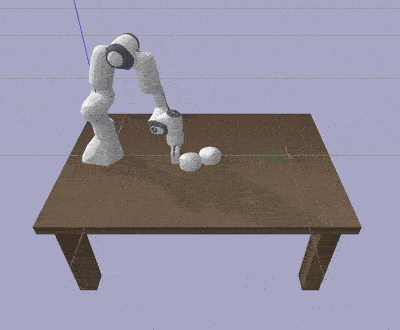
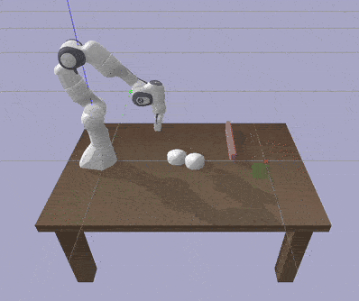

1. create a conda env and activate it
2. ./install.sh
3. collect data: 'python multi_dynamic_main.py collect'
4. train data: 'python multi_dynamic_main.py train --num_epochs 1000'
5. run trained model and show: 'python multi_dynamic_main.py demo_model --debug'
6. run trained model with optimized controller: 'python multi_dynamic_main.py opt_demo_model'
7. run demo: 'python demo.py'

#  Learning Multi-Body Dynamics

<table>
  <tr>
    <td colspan="2" align="center">
      <h2>Learning Multi-Body Pushing Manipulation with
Bayesian Optimization for MPPI Control</h2>
      

We study model-based pushing manipulation by combining learned residual multi-body dynamics with Model Predictive Path Integral (MPPI) control. Bayesian Optimization is employed to efficiently tune MPPI hyperparameters for robust, obstacle-aware pushing.
      

    </td>
  </tr>
  <tr>
    <td align="center">
      <b>Free Pushing</b> 
      
    </td>
    <td align="center">
      <b>Obstacle Pushing</b> 
      
    </td>
  </tr>
</table>

