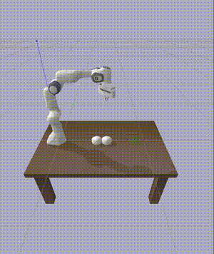

1. create a conda env and activate it
2. ./install.sh
3. collect data: 'python multi_dynamic_main.py collect'
4. train data: 'python multi_dynamic_main.py train --num_epochs 1000'
5. run trained model and show: 'python multi_dynamic_main.py demo_model --debug'
6. run trained model with optimization and show: 'python multi_dynamic_main.py opt_demo_model'

#  Learning Multi-Body Dynamics

